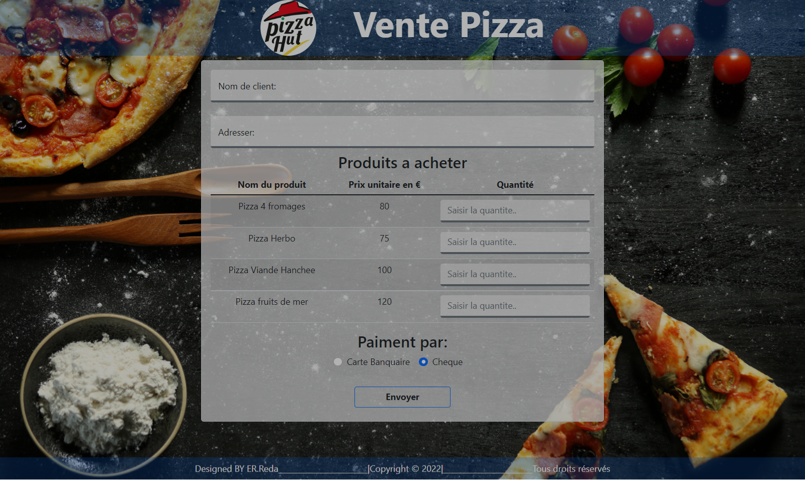

# WEB Application About Sale Pizza 

### Links

- Repository URL: <a href="https://github.com/ermix3/pizzaHut">GitHub Repo</a>
- Site URL: <a href="https://ermix3.github.io/pizzaHut/">Live</a>

## My process
first create html structure.
after i styled by css and bootstrap.
finaly i code the algrithm to select elements and work with it with javascript. 
### Built with

- Semantic HTML5 markup
- Template engine for HTML => PUG
- Framework CSS => Bootstrap5
- Mobile-first workflow

## Author

- Website - [Ermix](https://www.your-site.com)
- Frontend Mentor - [@ermix3](https://www.frontendmentor.io/profile/ermix3)